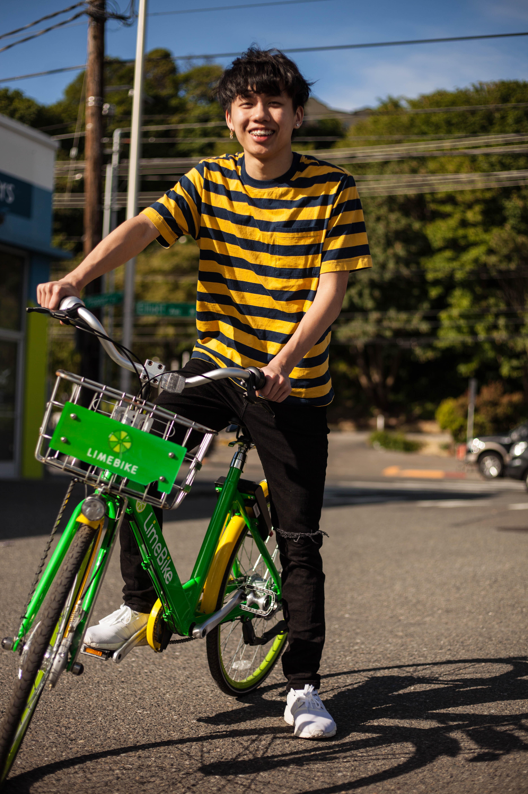

<!DOCTYPE html>
<html>

<head>
    <h1> Trevor Nguyen </h1>
    
<ul>
<li> <a href = "https://uw.joinhandshake.com/stu/users/16106676"> Handshake Profile </a> </li>

<li> <a href = "https://www.linkedin.com/in/trevor-nguyen-7a9549230/"> LinkdIn Profile </a> </li>
</ul>
<h2><blockquote>
"I'm just trynna go viral!" - Trevor Nguyen
</h2></blockquote>
</head>

<body>

    <h1> Employment History </h1>
    <h4> <strong> Esport Multimedia Outreach Coordinator (2021 - Present)</strong> </h4>
    <ul> 
    <li> Host in-person esport events (Microphone & all) </li>
    <li> Develop multi-media marketing campaigns </li>
    <li> Event planning for 50+ people </li>
    </ul>
    <h4><strong>Graphic Designer/ Machine Operator (2017 - 2019) </strong></h4>
    <ul>
    <li> Illustrate graphic designs with adobe premiere  </li>
    <li> Maintained complex machine operations </li>
    <li> Manage communications (phone, email, in-store) </li>
    </ul>

    <h1> Education </h1>
    <ul>
        <li> University of Washington (2018 - 2022) </li>
        <li> North Seattle College (2015 - 2017) </li>
        <li>Ingraham High School (2014 - 2017) </li>
    </ul>

<body>

</html>